# Spring Boot on Bluemix with IBM Continuous Delivery

The goal of this lab is to demonstrate deploying a simple Java web application to Bluemix with a DevOps pipeline for managing the application lifecycle. 

As part of this deployment, several actions are happening automatically through the use of configuration files found in the [.bluemix](.bluemix) folder. The two primary actions that are automatically configured to occur are deploying two different microservices from two different repositories and integrating multiple Bluemix services into the deployed applications. 

## Table of Contents

- [Prerequisites](https://github.com/IBM/spring-boot-continuous-delivery/blob/master/Readme.md#prerequisites)
- [Deployment Steps](https://github.com/IBM/spring-boot-continuous-delivery/blob/master/Readme.md#deployment-steps)
  - [Admin Dashboard Microservice](https://github.com/IBM/spring-boot-continuous-delivery/blob/master/Readme.md#admin-dashboard-microservice)
- [Access Cloudant DB service](https://github.com/IBM/spring-boot-continuous-delivery/blob/master/Readme.md#cloudant-db)
- [Updating Individual Microservices](https://github.com/IBM/spring-boot-continuous-delivery/blob/master/Readme.md#updating-individual-microservices)
- [Deployment Configuration](https://github.com/IBM/spring-boot-continuous-delivery/blob/master/Readme.md#deployment-configuration)
- [Associated Repositories](https://github.com/IBM/spring-boot-continuous-delivery/blob/master/Readme.md#associated-repositories)
- [Security Vulnerability Scanning](https://github.com/IBM/spring-boot-continuous-delivery/blob/master/Readme.md#security-vulnerability-scanning)

## Prerequisites

1. A Bluemix account is required to complete this lab.

    To sign up for a new account visit [Bluemix.net](https://console.ng.bluemix.net/ "Welcome to Bluemix")

2. A Slack team is an **optional** requirement to complete this lab.

    To sign up for a new team visit [slack.com](https://slack.com/)

## Deployment Steps

1. Log into the [Bluemix console](https://console.ng.bluemix.net/) and create a [Cloudant instance](https://console.ng.bluemix.net/catalog/services/cloudant-nosql-db/?taxonomyNavigation=services) named `sample-java-cloudant-cloudantNoSQLDB`.

2. Click the following Deploy to Bluemix button to load the initial toolchain setup:

    [](https://bluemix.net/deploy?repository=https://github.com/IBM/spring-boot-continuous-delivery)

3. Once the Tool Integrations have loaded, click on each of the four different integrations to see what settings are available to be changed. 

    **Note:** that the fields for GitHub, Eclipse Orion Web IDE, and Delivery Pipeline are automatically populated with data and no input should be required by the user unless changes to what was populated are desired.

    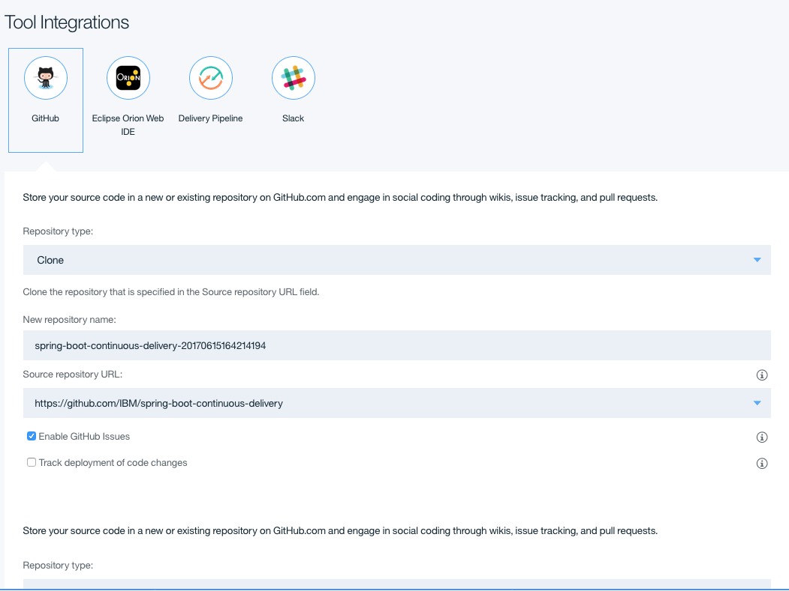
    
    **Optional:** Slack Integration. Skip to Step 4 if you choose not to configure it. 
    
    Slack Integration allows your team to be notified of events occuring in your Delivery Pipeline. To configure this integration, create an incoming webhook for your Slack team using the [Slack API](https://api.slack.com/incoming-webhooks). Once created, fill in the three fields listed under the Slack Integration.
    
    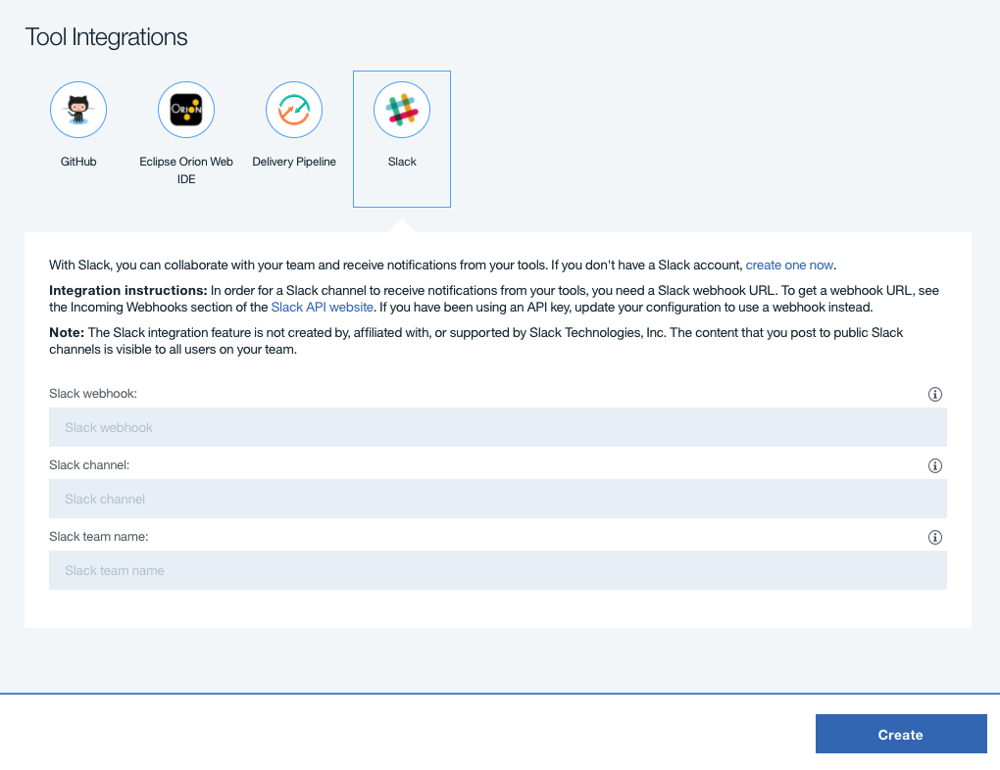

4. Click the "Create" button in the bottom right area of the window to instruct Bluemix to create a toolchain for you using the defined settings.

    

5. The page that loads after clicking create is the application's Toolchain. Here is the overview of all of the integrated services, the flow of the project, and easy navigation to each of the individual components of the application.

    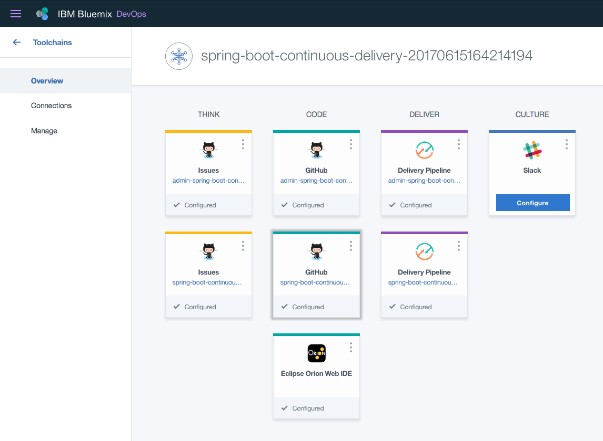

   **Note:** In this view, Slack was not configured in the previous step before clicking "Create". Slack can be configured at any time after creation of the Toolchain.

6. As soon as the "Create" button was pressed, Bluemix went to work deploying the application via the defined pipeline configurations. Click on the "Delivery Pipeline" box that starts with the words "spring-boot-continuous..." (shown below) in the Toolchain to view the code deployment pipeline of our primary application.

    

7. The pipeline page will dynamically update with the status of each step in the pipeline. When the deployment has finished running the bar on the top of the "Deploy Stage" will turn green.

In Progress                |  Finished
:-------------------------:|:-------------------------:
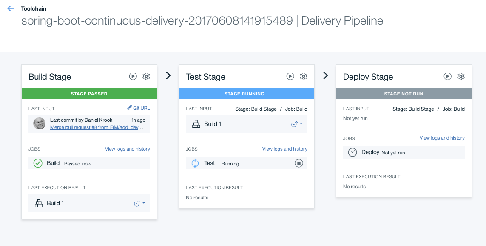  |  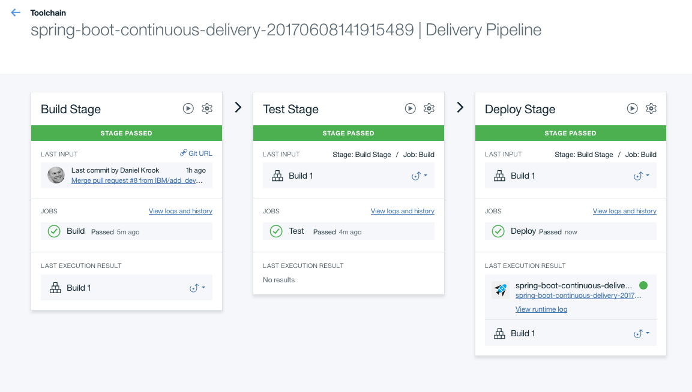

8. Once the "Deploy Stage" has turned green, indicating the job is complete, the link to the deployed application can be found in the mid-section of the "Deploy Stage" card.

    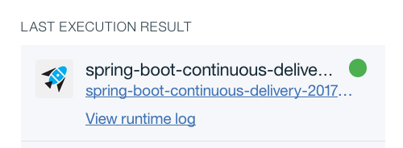

9. Upon clicking the application's URL, a new tab will open to the application's main page.

Create a New Account                |  Account Created
:-------------------------:|:-------------------------:
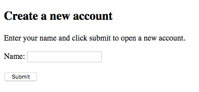  |  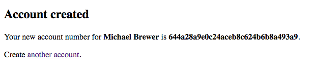

### Admin Dashboard Microservice

10. Return to the Toolchain page and click on the other pipeline that has not yet been viewed ("admin-spring-boot...").

    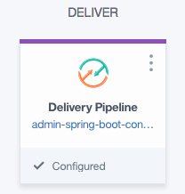
    
11. Once the pipeline page has loaded a similar set of deployment steps to our primary microservice can be found. Once the deployment has completed, click on the url listed in the middle of the "Deploy Stage" card. The URL will look similar to the one shown below.

    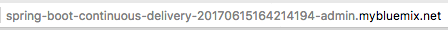

12. After the application's webpage has loaded a simulated admin dashboard will show the names and account ids created from the other microservice's webpage. The admin and main application are both communicating with the same Cloudant DB instance in the backend but have no direct communication between each other.

Full Account List                |  Searching Accounts
:-------------------------:|:-------------------------:
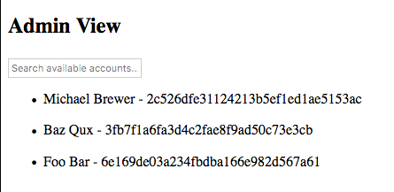  |  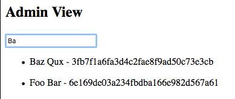

-----

## Cloudant DB

The following steps will show how to access the account that was just created in the Cloudant DB database

1. Return to [Bluemix](https://console.ng.bluemix.net/ "Welcome to Bluemix") and open the [Services Dashboard](https://console.ng.bluemix.net/dashboard).

    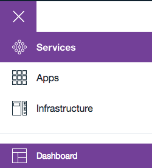

2. Once on the Services Dashboard, locate your Cloudant DB and click on it to open the service description page.

    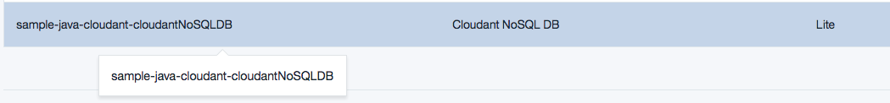

3. Click on the "LAUNCH" button near the top right of the page to load into the Cloudant DB dashboard.

4. Once the Cloudant DB dashboard has finished loading, select the databases tab on the left.

    

5. Click on the "Account" database. On the right you will see the account that was created from the web app above.

    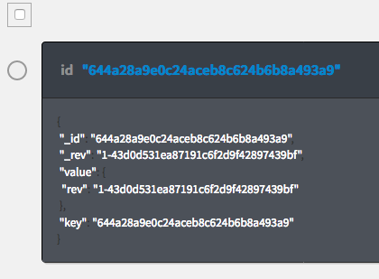

6. Click on the database entry to view more details.

    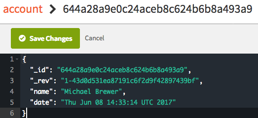
    
# Updating Individual Microservices

One of the great things about how Toolchains can be configured is that it can have multiple stand alone pipelines and code repositories. The way this Toolchain has been configured sets up two independent GitHub repositories and then two independent delivery pipelines. What that means is if you commit a change to one repository it will deploy that change automatically into its associated pipeline but the other repository and pipeline will be completely unaffected.

To demonstrate this, choose either of the two GitHub repositories to edit. For our demonstration, we are going to edit the main application's code. For simplicity, we're going to edit the `index.jps` file via the GitHub web interface.

1. Navigate to your cloned version of the project on [GitHub.com](https://github.com).

    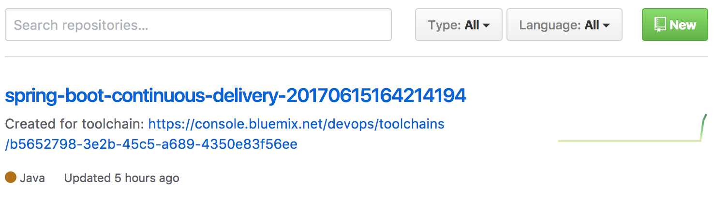

2. Navigate to the `index.jsp` file: src -> main -> webapp -> index.jsp

    ```https://github.com/[username]/spring-boot-continuous-delivery-123456/blob/master/src/main/webapp/index.jsp```
    
    **Note:** The above example URL will be different depending on your GitHub username and the string of numbers assigned to your cloned version of the application.
    
3. Open the index.jsp file for editing:

    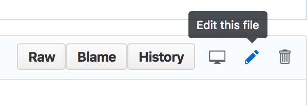
    
4. Change the application's header to "Create a new account. Edited!". See the following for reference:

```
<!DOCTYPE html>
<html lang="en">
<head>
    <meta charset="UTF-8">
    <title>Create a new account. Edited!</title>
</head>
<body>
    <h2>Create a new account</h2>
    <p>Enter your name and click submit to open a new account.</p>
    <form method="post" action="/account">
	    <label for="name">Name:</label>
	    <input type="text" name="name" id="name"><br><br>
	    <input type="submit" value="Submit">
    </form>
</body>
</html>
```

5. Save and commit the change to your index.jsp

    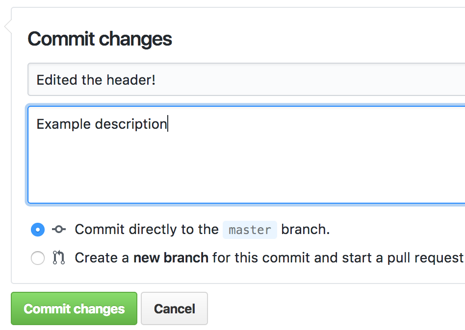
    
6. Return to your deployment pipelines to view the deployment progress. The application may deploy quickly, if it is done deploying before you can navigate back to it you can view recent deployment logs to verify that only the primary application was deployed with the recent commit. Click [here](https://console.ng.bluemix.net/devops/toolchains/) to navigate back to the Toolchain overview dashboard.

    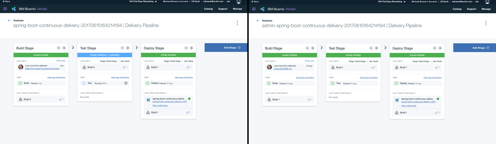
    
7. Finally, open the primary application's webpage again to view the recently committed change.

    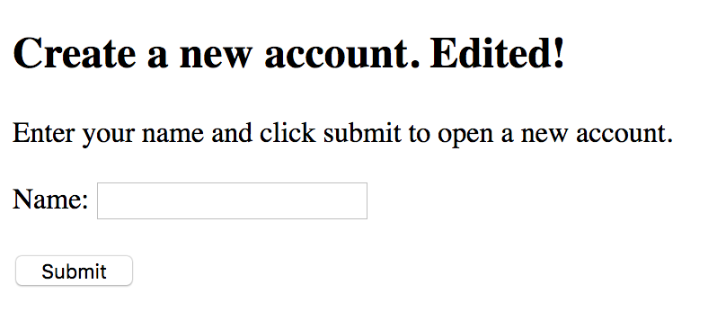

-----

# Deployment Configuration

In this application we use several different files that each server an important part of customizing our Bluemix deployment. Below we will give a brief overview of each file's function.

## toolchain.yml

File location: [.bluemix/toolchain.yml](.bluemix/toolchain.yml)

The toolchain.yml file is used to define the desired application name, integrated services, descriptions, environment properties, and more. This file is what pulls in the pipeline.yml, deploy.json, and custom Toolchain image used in this application.

For our application we have integrated GitHub as a code repository as well as for issue tracking, Eclipse Orian Web IDE for editing code via the web interface, and a pipeline to deploy the application from the integrated GitHub repository.

## deploy.json

File location: [.bluemix/deploy.json](.bluemix/deploy.json)

The deploy.json file is what allows user customization of the Toolchain via the UI before the user clicks deploy but after the user has clicked the "Deploy to Bluemix" button from the GitHub repository.

For our application we have configured the deploy.son file to capture and require three fields that will be used as environment variables by the toolchain.yml: selected-region, selected-organization, and selected-space. We have created a three column form that allows users to select fields for each of the afore mentioned variables if the defaults are not desired. Finally, we have called a helper function to validate the input variables.

## pipeline.yml

File location: [.bluemix/pipeline.yml](.bluemix/pipeline.yml)

The pipeline.yml file is used to configure the Bluemix Pipeline for an application. A toolchain can have multiple pipeline files. One way to rename the pipeline.yml files is to add a prefix to the pipeline.yml file's name: example-pipeline.yml. In the pipeline.yml file we can specify things such as build steps, environment variables, custom scripts and instructions, etc.

For our application we have configured the pipeline.yml to build our maven project to a custom location and then deploy the built .war file from the custom location. Additionally, in our pipeline.yml file we have specified the application memory limit using the `cf` command:

```cf push "${CF_APP}" -p "springboot-demo.war" -m 256M```

-----

# Associated Repositories

One of the primary aspects of this lab is to demonstrate simplified deployment of microservices from multiple repositories. As part of the setup for the different microservices a unique deployment pipeline cis reated for and connected to each of the individual microservice's repositories. By creating a different pipeline for each repository we are enabling each service to have its code updated and re-deployed completely independent of the operation of the other microservice; that is to say, by having two pipelines we can update the code for one microservice and the other microservice will be completely unaffected and unaware anything happened.

- Admin Dashboard Microservice: [https://github.com/IBM/spring-boot-continuous-delivery-admin](https://github.com/IBM/spring-boot-continuous-delivery-admin)

   **Note:** No direct interaction with the associated repositories is required. All of the deployment interaction is done through the current repository.
   
-----

# Security Vulnerability Scanning

Easily scan your web application for security vulnerabilites using the [Application Security on Cloud](https://console.ng.bluemix.net/catalog/services/application-security-on-cloud) service on Bluemix.

1. From the Bluemix Catalog click **Security** from the left-side menu, or simply search for **Application Security on Cloud** in the search prompt.

    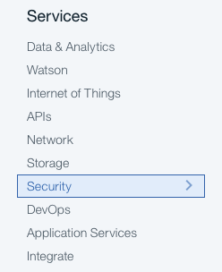
    
2. Click on the **Application Security on Cloud** service.
    
    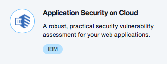

3. Choose a service name, or keep the pre-populated name. Click **Create**.
    
    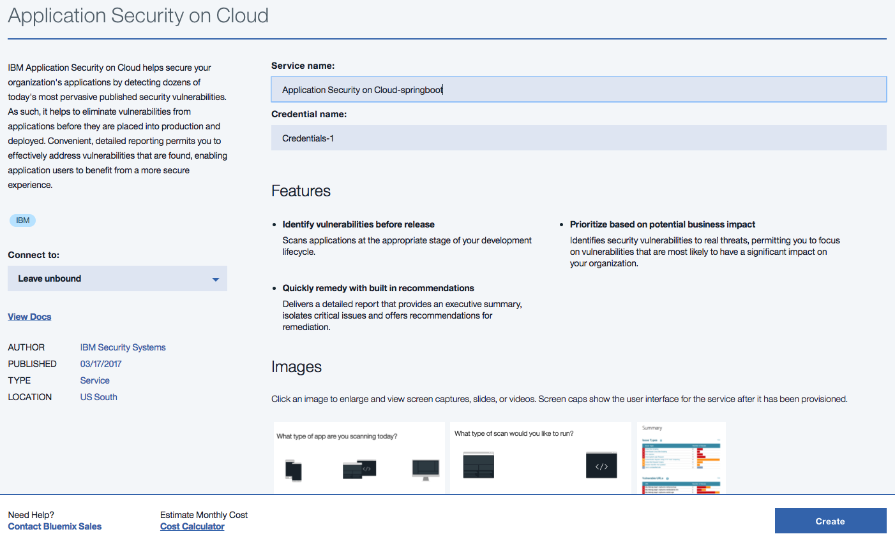

4. You will see three application options for scanning. Click **Web**.
    
    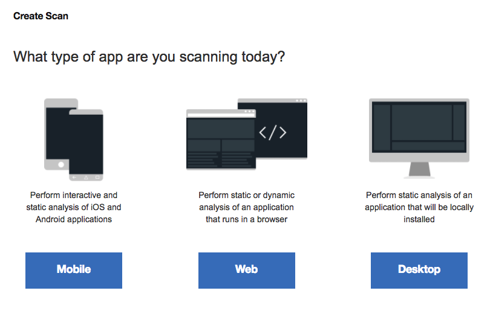

5. The next screen will ask you to choose a scan type. Click **Dynamic**.
    
    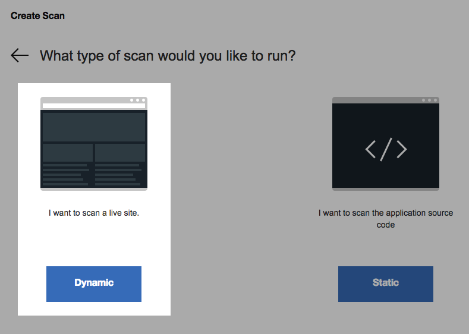

6. For site location choose **Public Network**.
    
    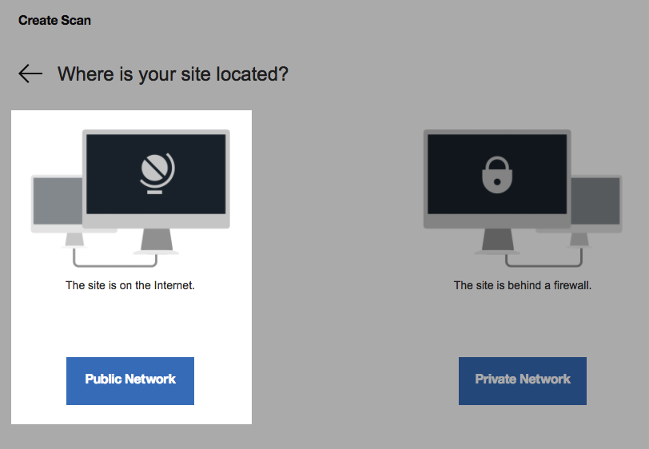

7. You will then be asked for a site URL. Enter you Bluemix application URL and click **Continue**.
    
    
    
    **Note**: You may be required to add a verification file to ensure your application URL is valid. If this occurs, place the `IBMDomainVerification.html` file in the `src/main/webapp/` directory of your cloned repo. Wait for the application to redeploy before scanning.

8. The next screen will contain various scan settings, leave these set to the defaults. Click **Scan**.
    
    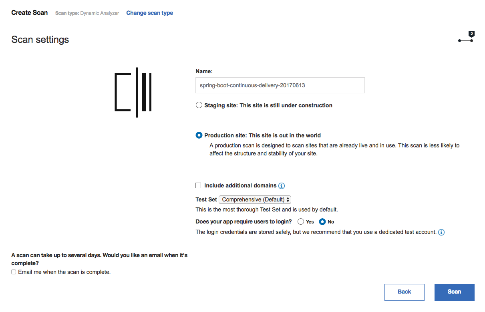
    
    Your security vulnerability scan will start running.
    
    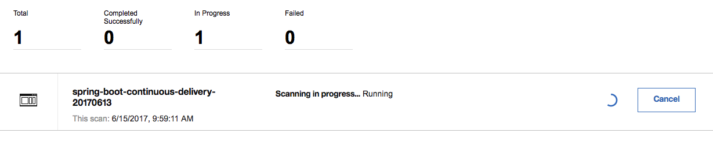
    
    Once the scan is complete you will see the total number of vulnerabitites and the associated severity ratings.
    
    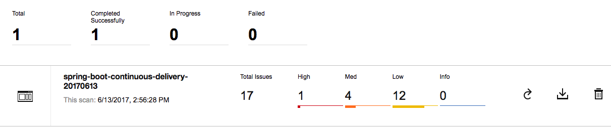

9. You can choose to download the detailed security report, and work to remediate the issues found.
    
    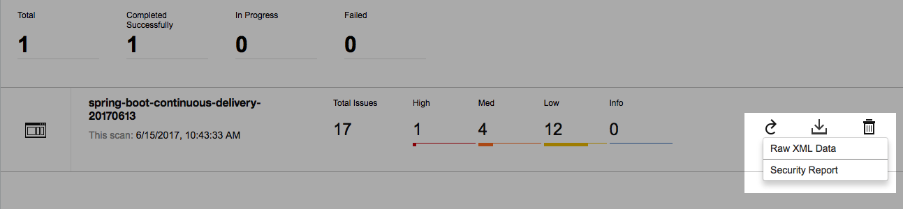

