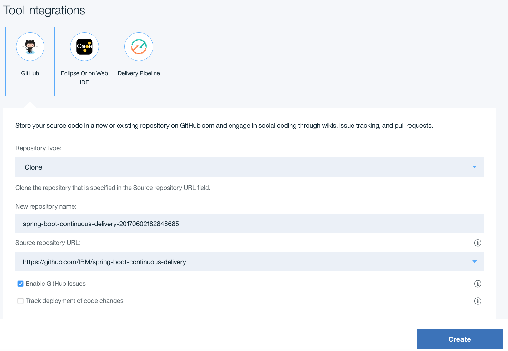
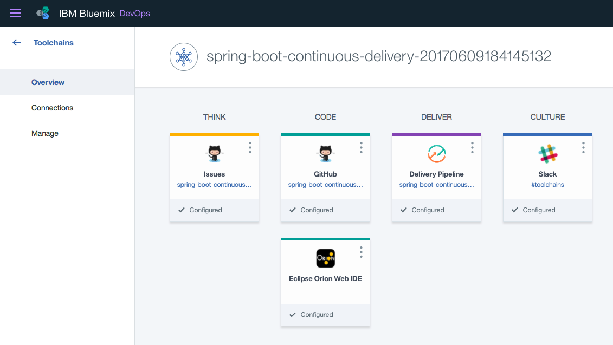

# spring-boot-continuous-delivery

The goal of this lab is to demonstrate deploying a simple web application to Bluemix.

## Prerequisite

A Bluemix account is required to complete this lab.

To sign up for a new account visit [Bluemix.net](https://console.ng.bluemix.net/ "Welcome to Bluemix")

## Steps

1. Log into the [Bluemix console](https://console.ng.bluemix.net/) and create a [Cloudant instance](https://console.ng.bluemix.net/catalog/services/cloudant-nosql-db/?taxonomyNavigation=services) named `sample-java-cloudant-cloudantNoSQLDB`.

2. Click the following Deploy to Bluemix button to load the initial toolchain setup:

[](https://bluemix.net/deploy?repository=https://github.com/IBM/spring-boot-continuous-delivery)

3. Once the Tool Integrations have loaded, click on each of the three different integrations to see what settings are available to be changed. Note that the fields are automatically filled populated with data and no input should be required by the user unless changes to what was populated are desired.



4. Click the "Create" button in the bottom right area of the window to instruct Bluemix to create a toolchain for you using the defined settings.


5. The page that loads after clicking create is the application's Toolchain. Here is the overview of all of the integrated services, the flow of the project, and easy navigation to each of the individual components of the application.



6. As soon as the "Create" button was pressed, Bluemix went to work deploying the application via the defined pipeline configurations. Click on the "Delivery Pipeline" box in the Toolchain to view the code deployment pipeline.


7. The pipeline page will dynamically update with the status of each step in the pipeline. When the deployment has finished running the bar on the top of the "Deploy Stage" will turn green.

In Progress                |  Finished
:-------------------------:|:-------------------------:
  |  

8. Once the "Deploy Stage" has turned green, indicating the job is complete, the link to the deployed application can be found in the mid-section of the "Deploy Stage" card.


9. Upon clicking the application's URL, a new tab will open to the application's main page.

Create a New Account                |  Account Created
:-------------------------:|:-------------------------:
  |  

-----

### The following steps will show how to access the account that was just created in the Cloudant DB database

1. Return to [Bluemix](https://console.ng.bluemix.net/ "Welcome to Bluemix") and open the [Services Dashboard](https://console.ng.bluemix.net/dashboard).


2. Once on the Services Dashboard, locate your Cloudant DB and click on it to open the service description page.


3. Click on the "LAUNCH" button near the top right of the page to load into the Cloudant DB dashboard.

4. Once the Cloudant DB dashboard has finished loading, select the databases tab on the left.


5. Click on the "Account" database. On the right you will see the account that was created from the web app above.


6. Click on the database entry to view more details.


-----

# Deployment Files

In this application we use several different files that each server an important part of customizing our Bluemix deployment. Below we will give a brief overview of each file's function.

## Toolchain.yml

File location: _/.bluemix/toolchain.yml_

The toolchain.yml file is used to define the desired application name, integrated services, descriptions, environment properties, and more. This file is what pulls in the pipeline.yml, deploy.json, and custom Toolchain image used in this application.

For our application we have integrated GitHub as a code repository as well as for issue tracking, Eclipse Orian Web IDE for editing code via the web interface, and a pipeline to deploy the application from the integrated GitHub repository.

## Deploy.json

File location: _/.bluemix/deploy.json_

The deploy.json file is what allows user customization of the Toolchain via the UI before the user clicks deploy but after the user has clicked the "Deploy to Bluemix" button from the GitHub repository.

For our application we have configured the deploy.son file to capture and require three fields that will be used as environment variables by the toolchain.yml: selected-region, selected-organization, and selected-space. We have created a three column form that allows users to select fields for each of the afore mentioned variables if the defaults are not desired. Finally, we have called a helper function to validate the input variables.

## Pipeline.yml

File location: _/.bluemix/pipeline.yml_

The pipeline.yml file is used to configure the Bluemix Pipeline for an application. A toolchain can have multiple pipeline files. One way to rename the pipeline.yml files is to add a prefix to the pipeline.yml file's name: example-pipeline.yml. In the pipeline.yml file we can specify things such as build steps, environment variables, custom scripts and instructions, etc.

For our application we have configured the pipeline.yml to build our maven project to a custom location and then deploy the built .war file from the custom location. Additionally, in our pipeline.yml file we have specified the application memory limit using the `cf` command:

```cf push "${CF_APP}" -p "springboot-greetings-demo.war" -m 256M```
