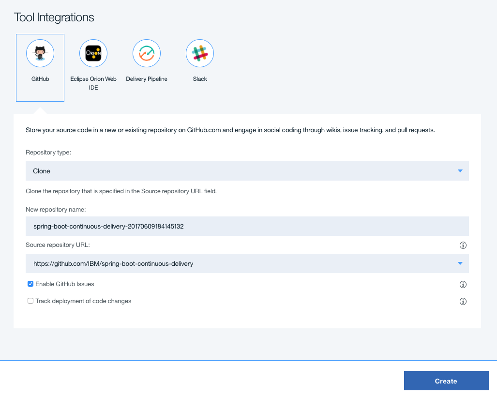

# **WORK IN PROGRESS**: spring-boot-continuous-delivery

The goal of this lab is to demonstrate deploying a simple web application to Bluemix as well as explain the different files used.

## Prerequisite

A Bluemix account is required to complete this lab.

## Steps

1. Click the following Deploy to Bluemix button to load the initial toolchain setup:

2. Once the Tool Integrations have loaded, click on each of the three different integrations to see what settings are available to be changed.

3. Click the "Create" button in the bottom right area of the window to instruct Bluemix to create a toolchain for you using the defined settings.

4. The page that loads after clicking create is the application's Toolchain. Here is the overview of all of the integrated services, the flow of the project, and easy navigation to each of the individual components of the application.

5. As soon as the "Create" button was pressed, Bluemix went to work deploying the application via the defined pipeline configurations. Click on the "Delivery Pipeline" box in the Toolchain to view the code deployment pipeline.

6. The pipeline page will dynamically update with the status of each step in the pipeline. When the deployment has finished running the bar on the top of the "Deploy Stage" will turn green.

In Progress                |  Finished
:-------------------------:|:-------------------------:
  |  

7. Once the "Deploy Stage" has turned green, indicating the job is complete, the link to the deployed application can be found in the mid-section of the "Deploy Stage" card.

8. Upon clicking the application's URL, a new tab will open to the application's main page.

------
#
